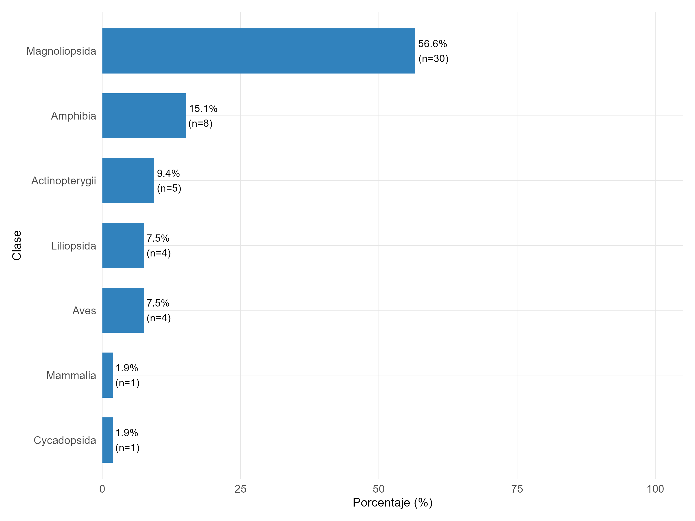
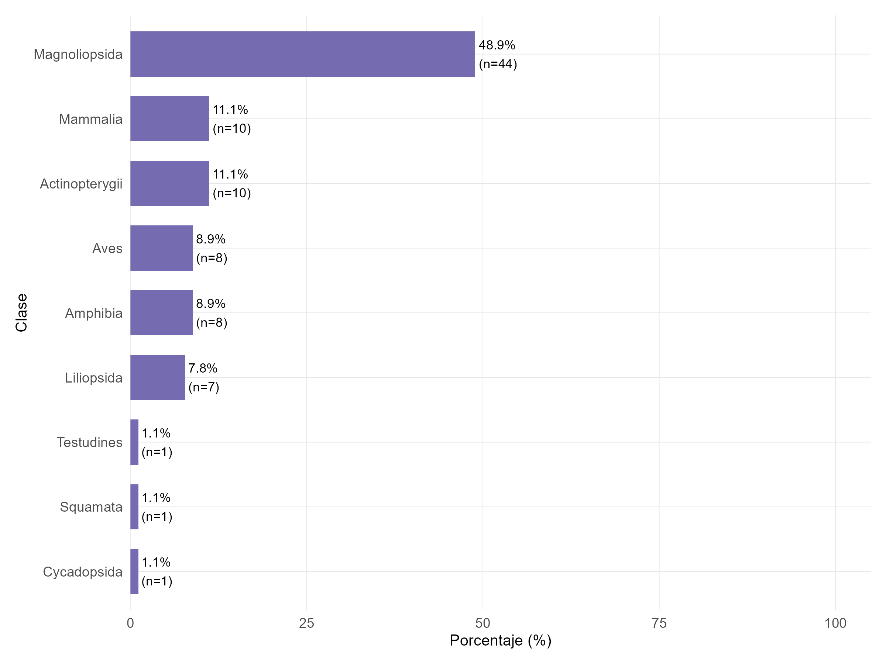
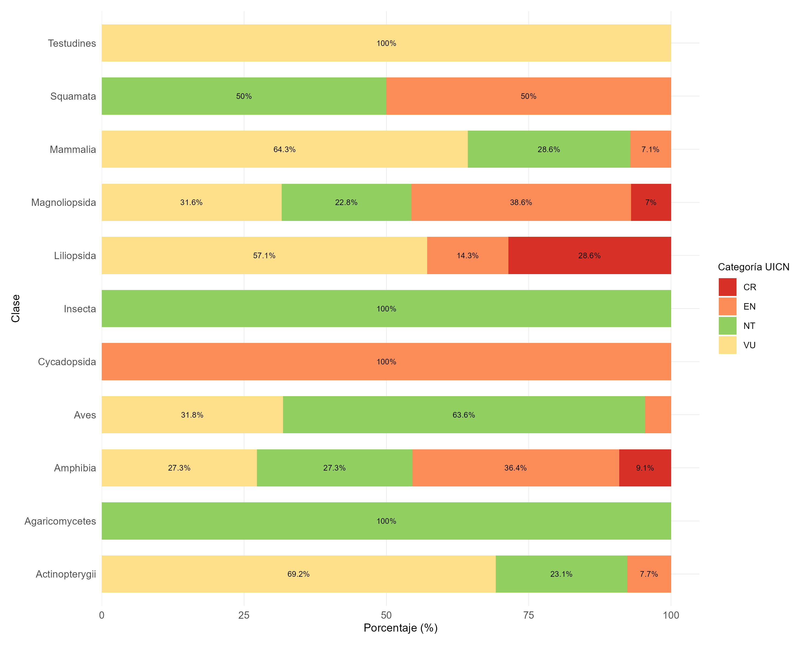
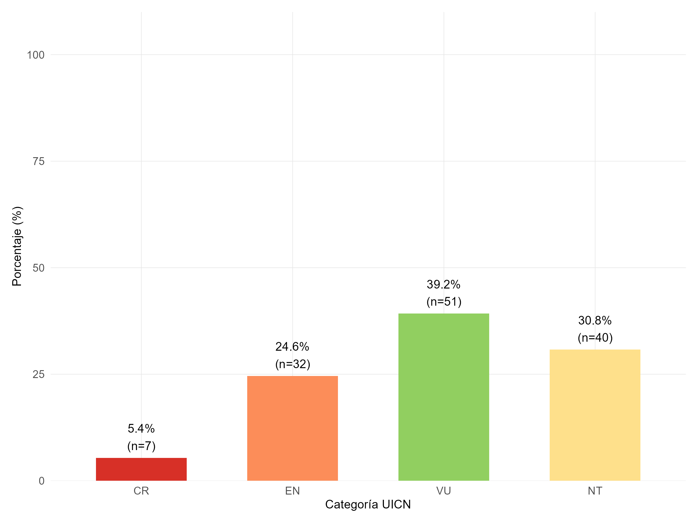
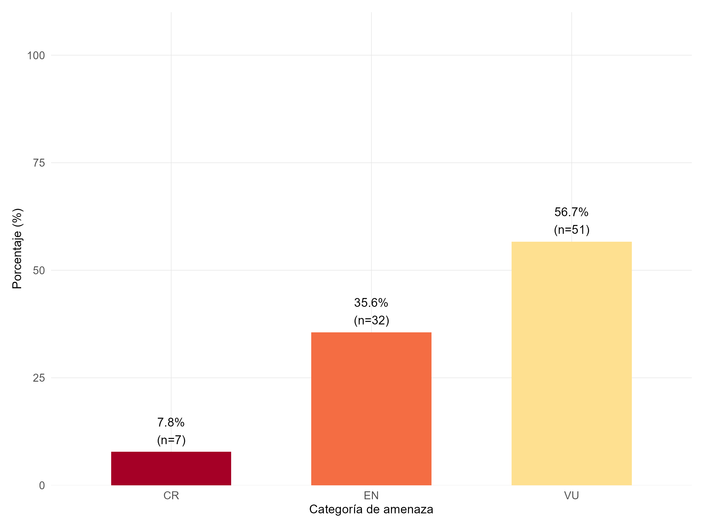
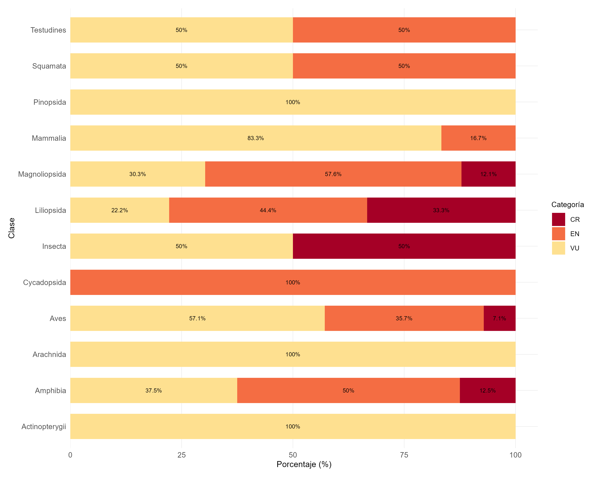
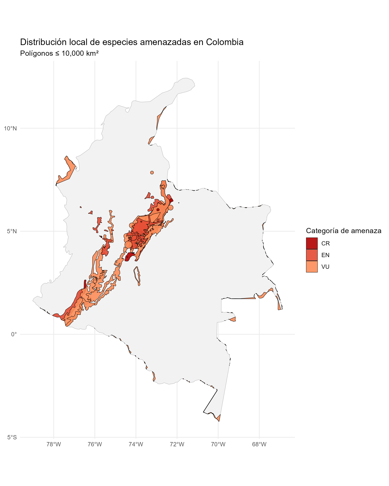
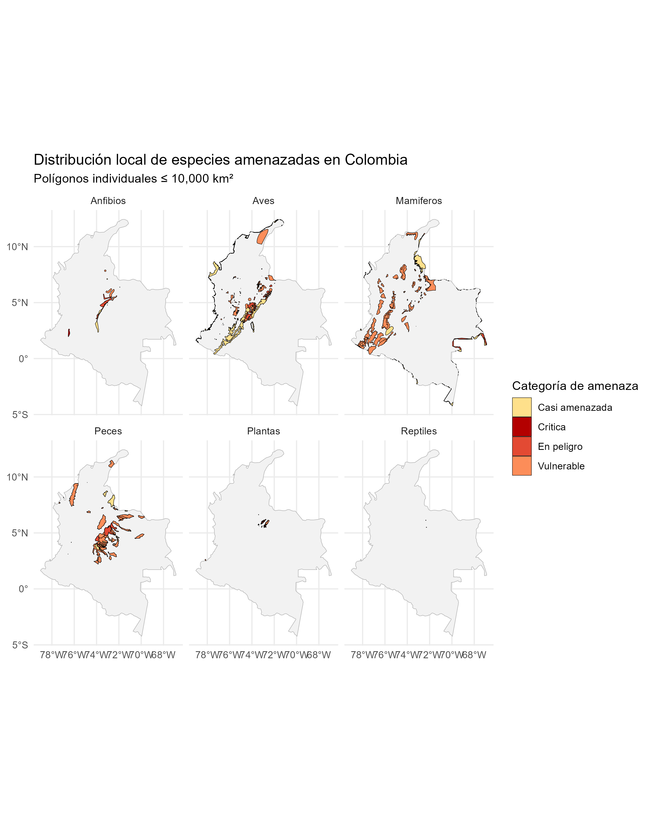

#  Propósito del STAR 

El propósito principal de la métrica STAR (Species Threat Abatement and Restoration) es cuantificar la contribución potencial de las acciones orientadas a mitigar amenazas y restaurar hábitats en la reducción del riesgo de extinción de especies a nivel global (cita). Esta métrica fue desarrollada para hacer explícitas espacialmente las acciones necesarias para detener y revertir la pérdida de especies (cita).

---

## ☘️ Qué hace

- Cuantificación de la contribución a la reducción del riesgo de extinción
- Identificación espacialmente explícita
- Apoyo a metas basadas en la ciencia
- Apoyo a la implementación del Marco Global de Biodiversidad
- Involucramiento de diversos actores
- Complemento a herramientas existentes
- Escalabilidad y versatilidad
- Adaptabilidad a diferentes tipos de datos
- Apoyo a la planificación de la conservación (pero no como herramienta única de priorización)
- Seguimiento del progreso

## 🌳Insumos

- Lista Roja de Especies Amenazadas de la UICN
- Base de Datos Mundial de Áreas Clave para la Biodiversidad (WDKBA)
- Datos de Cobertura del Suelo
- Mapas de Cambio en la Cobertura Forestal
- Modelos Digitales de Elevación (DEM)
- Listas Rojas Nacionales

---

## 🧭Limitaciones

###Limitaciones intrínsecas de STAR

- Enfoque en especies amenazadas o casi amenazadas
- Suposición de eliminación total de amenazas
- Simplificación de la restauración
- Consideraciones sobre la escala espacial
- Reflejo limitado de la complejidad de las amenazas
- Amenazas globales

###Limitaciones relacionadas con los datos subyacentes

- Enfoque en especies amenazadas o casi amenazadas
- Variabilidad en las listas rojas nacionales:

## 🧮 Índice STAR(T)

$$
STAR(T) =
\sum_{s}
\sum_{i}
N_s
P_{s,i}
W_s
C_{s,t}
$$

Donde:

$$
\begin{aligned}
N_s &= \text{Número de especies } s \text{ presentes en la unidad espacial} \\
P_{s,i} &= \text{Proporción del área de hábitat (AOH) de la especie } s \\
        &\quad \text{presente en la ubicación } i \\
W_s &= \text{Peso asociado al nivel de amenaza de la especie } s \\
C_{s,t} &= \text{Contribución de la amenaza } t \\
        &\quad \text{al riesgo de extinción de la especie } s
\end{aligned}
$$

## ⭐ Cálculo de STAR (R)

$$
STAR(R) =
\sum_{s}
\sum_{i}
N_s
P_{s,i}
W_s
R_{s}
$$

Donde:

$$
\begin{aligned}
N_s &= \text{Número de especies } s \text{ presentes en la unidad espacial} \\
P_{s,i} &= \text{Proporción del área de hábitat (AOH) potencialmente recuperable de la especie } s \\
        &\quad \text{en la ubicación } i \\
W_s &= \text{Peso asociado al nivel de amenaza de la especie } s \\
R_s &= \text{Potencial de recuperación de la especie } s \\
     &\quad \text{mediante acciones de restauración del hábitat}
\end{aligned}
$$

##🦇 Especies que se encuentran amenazadas segun IUCN

Para las 5735 especies reportadas en la zona del piedemonte de Casanare, un total de 62 especies son endémicas y se encuentran en algún grado de amenaza según la UICN, un 74.2% (46) de las especies se encuentran en peligro y vulnerable, mientras que un 14.5% de taxones se encuentra en casi amenazados y 11.3% en peligro crítico. En contraste, para la zona las especies no endémicas se distribuyen en las categorías de casi amenazadas con 45.6%, en vulnerables con un 41.2%, y un 13.2% en peligro.

  

La mayoría de especies amenazadas y que son endémicas pertenece a las plantas que comprenden las clases Magnoliopsida (55.6%), Liliopsida (7.5%), y Cicadopsida (1.9%), para el reino Animalia, la mayoría corresponde a anfibios (15.1%), seguido por los peces de la clase Actinopterygii (9.4%), las aves (7.5%) y por ultimo, los mamíferos (1.9%).

  

Para las especies amenazadas en términos generales las plantas agrupan gran parte de los taxones que se encuentran en la lista roja, con un 57.8%, por partes de los animales los mamíferos y peces concentran el 22.2% de los especímenes amenazadas para la zona, los herpetos (reptiles y anfibios) comprenden el 11.1%, por último, las aves con el 8.9%.

  

Para el piedemonte los taxones pertenecientes a las clases Magnolipopsida (7%), Liliopsida (28.6%) y Amphibia (9.1%), incluyen organismos en estado de amenaza crítico. Dentro de los vertebrados destacan clases como Squamata (50%) y Mammalia (7.1%), las cuales presentan entre los registros reportadas un considerable número de taxones que pertenecen al segundo nivel de amenaza (En peligro), de igual manera, especies que se encuentran en la clase Actinoptergi (69.2%) y Testudines (100%), representan un valor importante en términos de conservación ya que en su mayoría  estos organismos reportados en la zona se encuentran en categoría vulnerable. 

  

En términos generales la mayoría de especies amenazadas para la zona usando el criterio de la UICN están en la categoría vulnerable con el 39.2%, le siguen aquellos taxones que se encuentran casi amenazados con el 30.8%, mientras que el segundo nivel de amenaza en peligro se encuentra el 24.6% de los registros para la zona, por último, para el grupo de taxones que requieren un mayor grado de atención que es en peligro crítico pertenece al 5.4% del total. 

  

##🐸 Especies amenazadas segun resolucion 126 de 2024

En términos de la resolución 126 de 2024, que establecen las especies amenazadas bajo un criterio nacional, se observa que la mayoría de especies se encuentran en un categoría vulnerable alcanzando el 46.7% de los registros de la zona, seguido por los taxones que se encuentran en peligro con el 41.1%, y por último en peligro crítico a nivel local se encuentran 12.2% de los grupos reportados para la zona de interés.

  

Para las diferentes categorías taxonómicas observadas en la zona, destaca la clase Insecta que tiene el 50% de las especies en nivel crítico según las categorías de amenaza nacionales. Un patrón similar se observa con los taxones presentes en las clases Liliopsida con el 33,3%, Amphibia con el 12.5%, Magnoliopsida con el 12.1% y Aves con el 7.1%. 
Dentro del siguiente grado de amenaza en peligro resaltan las clases pertenecientes al reino plantae,  dentro de la cuales Cycadopsida, Magnoliopsida y Liliopsida contienen un número considerable de especies con valores superiores al 40%, una respuesta similar se observa en vertebrados de la clase Amphibia, Testudines y Squamata en la cuales el 50% de estas se encuentra en este nivel de amenaza. 

  

##🦎 Poligonos de especies amenazdas segun categoria UICN

  

### Poligonos de especies amenazadas por grupo

  

##🦜 Poligonos de especies amenazdas segun categoria de resolucion 126 de 2024

  

### Poligonos de especies amenazadas por grupo segun categoria de resolucion 126 de 2024

  

