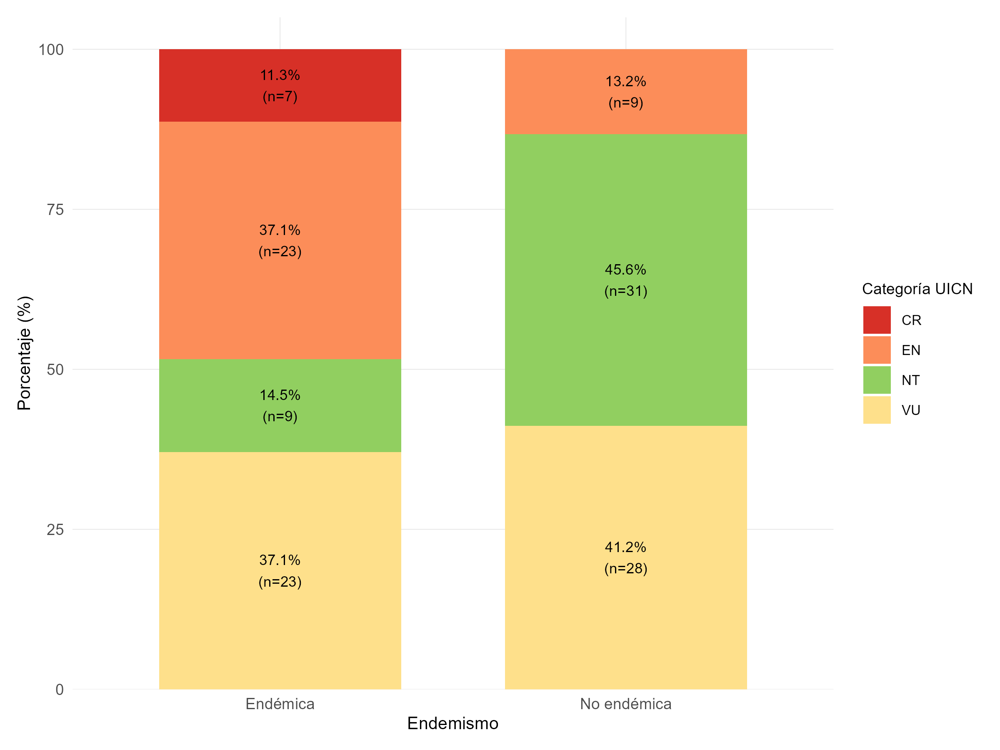

#  Propósito del STAR 

El propósito principal de la métrica STAR (Species Threat Abatement and Restoration) es cuantificar la contribución potencial de las acciones orientadas a mitigar amenazas y restaurar hábitats en la reducción del riesgo de extinción de especies a nivel global (cita). Esta métrica fue desarrollada para hacer explícitas espacialmente las acciones necesarias para detener y revertir la pérdida de especies (cita).

---

## ☘️ Qué hace

- Cuantificación de la contribución a la reducción del riesgo de extinción
- Identificación espacialmente explícita
- Apoyo a metas basadas en la ciencia
- Apoyo a la implementación del Marco Global de Biodiversidad
- Involucramiento de diversos actores
- Complemento a herramientas existentes
- Escalabilidad y versatilidad
- Adaptabilidad a diferentes tipos de datos
- Apoyo a la planificación de la conservación (pero no como herramienta única de priorización)
- Seguimiento del progreso

## 🌳Insumos

- Lista Roja de Especies Amenazadas de la UICN
- Base de Datos Mundial de Áreas Clave para la Biodiversidad (WDKBA)
- Datos de Cobertura del Suelo
- Mapas de Cambio en la Cobertura Forestal
- Modelos Digitales de Elevación (DEM)
- Listas Rojas Nacionales


---

## 🧮 Índice STAR(T)

$$
STAR(T) =
\sum_{s}
\sum_{i}
N_s
P_{s,i}
W_s
C_{s,t}
$$

Donde:

Donde:

$$
\begin{aligned}
N_s &= \text{Número de especies } s \text{ presentes en la unidad espacial} \\
P_{s,i} &= \text{Proporción del área de hábitat (AOH) de la especie } s \\
        &\quad \text{presente en la ubicación } i \\
W_s &= \text{Peso asociado al nivel de amenaza de la especie } s \\
C_{s,t} &= \text{Contribución de la amenaza } t \\
        &\quad \text{al riesgo de extinción de la especie } s
\end{aligned}
$$


## 🚀 Instalación

## Especies que se encuentran amenazadas segun IUCN

<p align="center">
  
</p>


```bash
pip install habitat-tool

## 🚀 Nueva sección
Contenido de prueba

